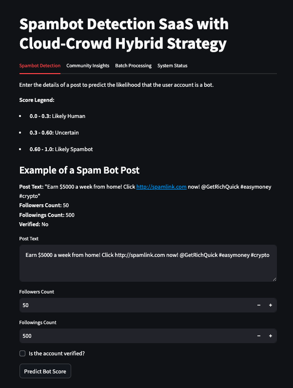
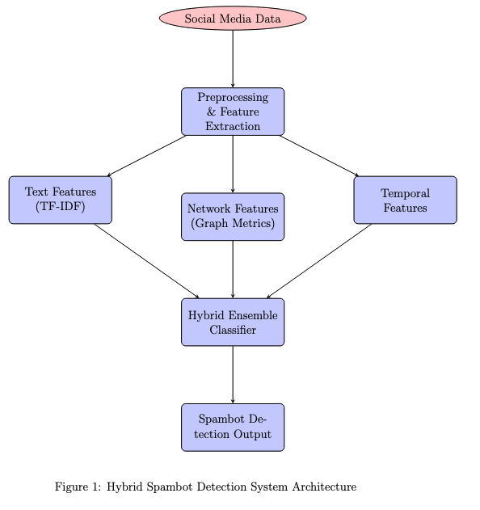
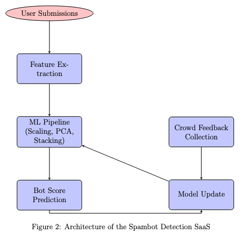

# Crowdsourcing and Cloud Computing: Spambot Detection SaaS

## Overview
This project implements a Software-as-a-Service (SaaS) solution for detecting spambots on social media by combining advanced machine learning techniques with a crowdsourcing feedback loop. The system extracts human-readable features from social media posts and account metrics (followers, followings, and verification status) and processes these features through a sophisticated ML pipeline to predict a bot score.


 

## Key Features

- **Feature Extraction:**  
  The solution extracts a 20-dimensional feature vector from the input data. Key features include:
  - **Textual Features:** Normalized text length, mention ratio, hashtag ratio, and URL ratio.
  - **Account Metrics:**  
    - *Inverted Normalized Followers:* Accounts with very few followers (≤ 50) are flagged as high risk (score = 1.0) while accounts with ≥ 200 followers receive a low risk score (0.0).
    - *Normalized Followings Ratio:* Calculated as followings divided by the total of followers and followings. A higher ratio indicates suspicious behavior.
  - **Linguistic Cues:** Unique word ratio, average word length, exclamation ratio, capital letter ratio, numeric token ratio, and repetition factor.
  - **Composite Indicator:** A follower-following pattern feature that highlights accounts with extremely low followers and very high followings.
  - **Dummy Features:** Reserved for future enhancements.

- **Machine-Learning Pipeline:**  
  The extracted features are processed through a pipeline that includes:
  - **Scaling:** Using `StandardScaler` to normalize features.
  - **PCA:** Reducing dimensionality to capture the most significant variance and reduce noise.
  - **Stacking Classifier:** An ensemble method that combines RandomForest, SVC, and LogisticRegression, with a meta-classifier to improve pattern recognition.
  
  

- **Crowdsourcing Feedback Loop:**  
  The SaaS collects user feedback on predicted bot scores. This feedback is periodically used to retrain and update the model, enabling continuous improvement and adaptation to evolving spambot behaviors.

- **User Interface (UI):**  
  Built using Streamlit, the UI allows users to:
  - Input post details and account metrics.
  - View the extracted features and their human-readable explanations.
  - Submit feedback to improve the model.
  - Process batch submissions via CSV upload.
  - Monitor system status and view community insights.

## Limitations and Future Work

- **Borderline Scores:**  
  Some spam posts may receive only a borderline bot score (e.g., around 0.5523), which raises suspicion but does not conclusively indicate spam. More data is needed to refine these edge cases.

- **Feedback Dependence:**  
  The model’s performance is highly dependent on user feedback. With minimal feedback, the model cannot reliably adapt or retrain.

- **Feature Sensitivity:**  
  While the current feature extraction effectively leverages account metrics and textual cues, real-world spambot behavior can be more nuanced. Future work will explore additional feature engineering (e.g., social network analysis) and incorporate deep learning techniques to improve detection accuracy.

Future research will focus on expanding the training dataset with real-world examples, enhancing feature extraction (especially from social graphs), and integrating deep learning methods to further boost detection accuracy.

## System Architecture

The architecture integrates cloud-based machine learning with a crowdsourcing component for continuous improvement. The following diagram illustrates the overall data flow:




### Detailed Workflow:
1. **User Submissions:**  
   Users submit posts along with account metrics via the Streamlit UI.
2. **Feature Extraction:**  
   The system extracts a 20-dimensional feature vector from the submitted data.
3. **ML Pipeline:**  
   The features are normalized, reduced in dimensionality (via PCA), and then processed by a stacking classifier.
4. **Bot Score Prediction:**  
   The model outputs a bot score indicating the likelihood that the account is a spam bot.
5. **Crowd Feedback:**  
   Users provide feedback on the prediction, which is used for periodic model retraining and updates.

## Getting Started

### Prerequisites
- Python 3.8 or higher
- Required Python packages (listed in `requirements.txt`)

### Installation
1. Clone the repository:
    ```bash
    git clone https://github.com/yourusername/spambot-detection-saas.git
    cd spambot-detection-saas
    ```
2. Install the required packages:
    ```bash
    pip install -r requirements.txt
    ```

### Running the Application
To run the Streamlit app locally, use:
```bash
streamlit run app.py
